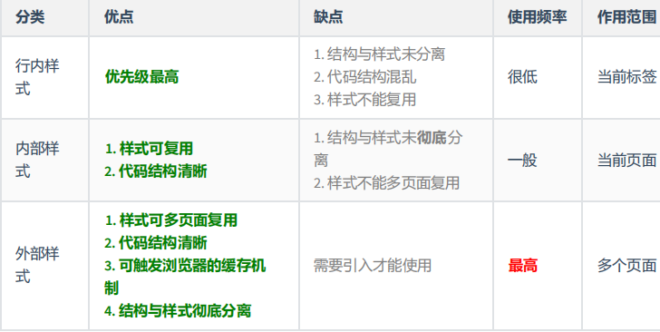
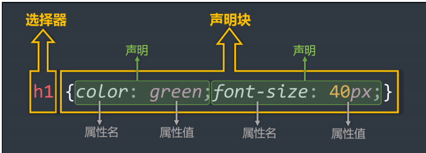
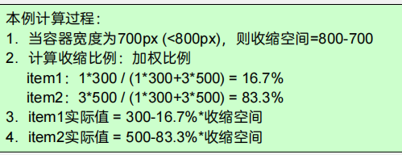

# 快速回顾之CSS

​		本文旨在回顾CSS各个知识点，更多Blog可访问[我的博客网站](http://www.canlee.top/)

## CSS简介

- CSS 的全称为：层叠样式表 ( Cascading Style Sheets ) 。
- CSS 也是一种标记语言，用于给 HTML 结构设置样式，例如：文字大小、颜色、元素宽高等等。

> HTML：结构
>
> CSS：表现
>
> JavaScript:行为

> 简单理解： CSS 可以美化 HTML , 让 HTML 更漂亮。
>
> 核心思想： HTML 搭建结构， CSS 添加样式，实现了：结构与样式的分离。

## CSS的编写位置

### 行内样式

- 写在标签`style`属性中，又称内联样式。
- 语法：

```js
<h1 style="color:red;font-size:60px;">Hello world!</h1>
```

- 注意点：

> 1. style 属性的值不能随便写，写要符合` CSS` 语法规范，是 `名:值; `的形式。
> 2. 行内样式表，只能控制当前标签的样式，对其他标签无效。

- 存在的问题：

> **书写繁琐、样式不能复用、并且没有体现出**：**结构与样式分离** 的思想，不推荐大量使用，只
>
> 有对当前元素添加简单样式时，才偶尔使用。

### 内部样式

- 写在 html 页面内部，将所有的 CSS 代码提取出来，单独放在 <style> 标签中。

- 语法

```html
<style>
h1 {
color: red;
font-size: 40px;
}
</style>
```

> - 注意点：
>
>   标签理论上可以放在 HTML 文档的任何地方，但一般都放在标签中。
>
>    此种写法：样式可以复用、代码结构清晰。
>
>

- 存在的问题：

> 1. 并没有实现：结构与样式**完全分离**。
> 2. 多个 HTML 页面无法复用样式。

### 外部样式

- 写在单独的 .css 文件中，随后在 HTML 文件中引入使用。

- 语法：

> 1. 新建一个扩展名为 .css 的样式文件，把所有 CSS 代码都放入此文件中。
> 2. 在 HTML 文件中引入 .css 文件。

```html
<link rel="stylesheet" href="./xxx.css">
```

- 注意点：

> 1. <link> 标签要写在 <head> 标签中。
> 2. <link> 标签属性说明：
> href ：引入的文档来自于哪里。
> rel ：( relation ：关系）说明引入的文档与当前文档之间的关系。
> 3. 外部样式的优势：样式可以复用、结构清晰、可触发浏览器的缓存机制，提高访问速
> 度 ，实现了结构与样式的完全分离。
> 4. 实际开发中，几乎都使用外部样式，**这是最推荐的使用方式！**

###  样式表的优先级

- 优先级规则：**行内样式 > 内部样式 = 外部样式**

> 1. 内部样式、外部样式，这二者的优先级相同，且：后面的 会覆盖 前面的（简记：“后来
>
> 者居上”）。
>
> 2. 同一个样式表中，优先级也和编写顺序有关，且：后面的 会覆盖 前面的（简记：“后来
>
> 者居上”）。



### CSS语法规范

CSS 语法规范由两部分构成：

- **选择器**：找到要添加样式的元素。
- **声明块**：设置具体的样式（声明块是由一个或多个声明组成的），声明的格式为： 属性名: 属性值;

> 备注1：最后一个声明后的分号理论上能省略，但最好还是写上。
>
> 备注2：选择器与声明块之间，属性名与属性值之间，均有一个空格，理论上能省略，但最好
>
> 还是写上。



- 注释

```css
/* 给h1元素添加样式 */
h1 {
/* 设置文字颜色为红色 */
color: red;
/* 设置文字大小为40px */
font-size: 40px
}
```

### CSS代码风格

- **展开风格** —— 开发时推荐，便于维护和调试。

- **紧凑风格** —— 项目上线时推荐，可减小文件体积。
- 备注：

> 项目上线时，我们会通过工具将【展开风格】的代码，变成【紧凑风格】，这样可以减小文
>
> 件体积，节约网络流量，同时也能让用户打开网页时速度更快。

## CSS选择器

### 基本选择器

> 1. 通配选择器  **\*{}**
> 2. 元素选择器  **div{}**
> 3. 类选择器     **.className**
> 4. id 选择器     **#id**

#### 通配选择器

- 作用：选中所有的HTML元素

- 语法：

```css
* {
	属性名: 属性值;
}
```

- 举例：

```css
/* 选中所有元素 */
* {
	color: orange;
	font-size: 40px;
}
```

> 备注：目前来看通配选择器貌似有点鸡肋，但后面清除样式时，会对我们有很大帮助，后面会详细
>
> 讲。

#### 元素选择器

- 作用：选中页面中 **某种元素** 统一设置样式

- 语法：

```css
标签名 {
	属性名: 属性值;
}
```

- 举例：

```css
/* 选中所有h1元素 */
h1 {
	color: orange;
	font-size: 40px;s
}
/* 选中所有p元素 */
p {
	color: blue;
	font-size: 60px;
}
```

- 备注：元素选择器无法实现**差异化设置**，例如上面的代码中，所有的 p 元素效果都一样。

#### 类选择器 一个元素可以有多个类名，多个元素可以有统一类名

#### id选择器 一个元素对应一个id

### 总结

| 基本选择器 | 特点                                                  | 用法                 |
| ---------- | ----------------------------------------------------- | -------------------- |
| 通配选择器 | 选中所有标签，一般用于清除样式。                      | `* {color:red}`      |
| 元素选择器 | 选中所有同种标签，但是不能差异化选择。                | `h1 {color:red}`     |
| 类选择器   | 选中所有特定类名（ class 值）的元素 —— 使用频率很高。 | `.say {color:red}`   |
| ID 选择器  | 选中特定 id 值的那个元素（唯一的）。                  | `#earthy{color:red}` |


## 3D变换

#### 11.1. 开启3D空间


### 3D效果与景深


## flex box

#### 伸缩之伸:

​		情况，若是在flex布局里面，父容器的容量没有布满，这时候会让直接子元素取分，直接按比例来"瓜分"容器"多余空间

**计算公式**：**flex_basis**值 + 扩张比例 （ flex-grow）/ Σ扩张比例   * (多余总空间)

**ps：flex_basis**，这个值是浏览器哪来计算子元素的宽度的，若是不设置，默认值就是元素设置的宽度

若是多余300px 比例可以是 1 1 1或者1 2 3 按照这样的比例来分；


#### 伸缩之缩：



**计算公式**：flex-basis值 - (flex-basis*收缩系数) / Σ(flex-basis*收缩系数) * (收缩总空间)

分三步：

1.首先算差多少，也就是收缩空间，怎么算？只算内容！也就是说边框会影响计算，为了保证边框为，压缩的其实是内容区域

2.计算加权比例

3.计算实际值

收缩讲究的是加权，为什么不按照伸的比例来缩呢？主要是考虑到有的元素收缩的宽度不能满足比例的宽度

比如：子元素有width：30px但是按照比例需要收缩50px，这时就出现问题了

还有一个值得注意的点：收缩也会有一个阈值，也就是再怎么收缩也只能收缩到本身内容的大小。（伸缩的元素时开启伸缩盒子的直接子代，也就是说子代的子代设置的宽度无法收缩）