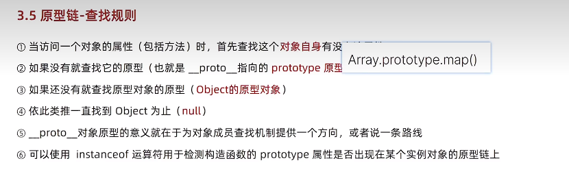
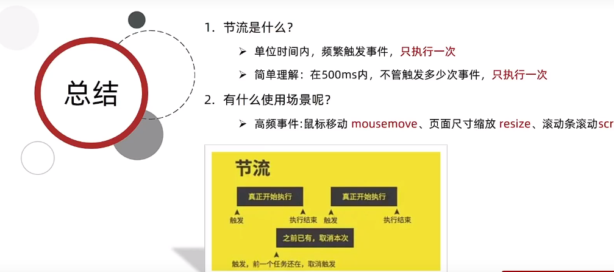

### 作用域链

作用域链的本质是底层变量查找机制

函数执行时，会优先查找当前函数作用域中的查找变量

若果当前作用域查不到则会逐级查找父级作用域直到全局作用域


### 垃圾回收机制


- 引用计数法：引用几次标记几次，最后为0给回收，问题：循环引用导致内存泄漏

- **标记清除法：**定期从根节点触出发，无法到达的回收

### 闭包


### 变量提升

var 声明的变量会提升声明，并且只提升声明

### 函数提升

函数的声明定义都会提到最前面

函数表达式

```js
var fun = (x) => {
    x = 123;
    ....
}
```

### 函数的参数

#### 动态参数

利用arguments(伪数组：不可以pop，push......可以用下标获取)来获取参数

#### 剩余参数

利用(...arr)来接受参数，常用

可以在知道用户起码会输入的参数，还可以处理不确定的

例如：用户输入姓名电话，但是可以不输入地址，这个时候地址就可用剩余参数接受

```js
function getInfo(name,tel,...info)
```

### 展开运算符

求数组最大值最小值

`Math.max(...arr)`

合并数组

```js
const arr = [...arr1,...arr2]
```

## 箭头函数

简化代码


#### 基本语法：

```js
() => {
    console.log(...);
}
```

- 若是只有一个形参可以省略小括号
- 若是只有一行代码则可以省略大括号

- 若是只有一行代码可以省略return

#### 箭头里面的参数

- 没有arguments
- 有剩余参数

```js
let fun = (...arr)=>{
        let sum = 0;
        arr.forEach(num => sum+=num)
        console.log(sum)//15
}
fun(1,2,3,4,5)
```

#### this指向 

​		箭头函数内部是没有this的，由于作用域的关系，在箭头函数中使用this会沿着作用域链来找到this的指向

#### 对象方法箭头函数 this

ps:只有函数中才使用this

### 解构赋值

### 数组的解构

相当于批量的赋值，简化代码

```js
const [a,b,c] = arr;
//const [a,b,c] = [1,2,3]
```

#### 交换属性值

```js
let a = 1;
let b = 1;
[b,a]  = [a,b]
```

​	一定要加`;`由于下方数字开头（**立即执行函数也需要**）

> 单元值少和单元值多都是一样的处理

- 可以使用剩余参数来接受多余的数据
- 可以使用默认值来防止undefined
- 可以利用`, ,`l来不赋值跳过

### 对象解构


​		可以对后台传来的数据进行结构直接拿到data


## 深入对象

- 字面量创建对象
- new Object（系统给的）
- 构造函数创建


## 数组的常用方法


### 4、reduce

​		两个参数，第一个是回调函数（prev，cur）

执行过程：


- 若是没有初始值，第一次就是执行的下标为`0`和`1`的元素
- 若是有初始值，第一次的`prev`取得是初始值，`curr`取得是`nums[0]`

若是对象


### 便于理解


find：找到了立马返回，函数结束，可以过滤出返回对象（只找到一个）


### 伪数组换成真数组

`querySelectorAll()`出一个伪数组 `lis`

`liss = Array.from(lis)` 这样就变为真数组了

### 字符串String


- `split`将字符创转化为数组

- `substring(begin，[,end])`区间的字符串，**前闭后开**，返回新的

- `string.startWith(字符串,[,开始索引])`以什么开头 返回 `T or F`

- `includes(字符串，[,开始位置])`包含字符串吗？ 返回 `T or F`

## 原型

原型是一个对象，也称`prototype`为原型对象，挂在构造函数上，可以：

**共享方法**：把公用的，不变的方法定义在`prototype`上

> **this指向**：实例化对象
>
> 构造函数中的`this`指向的是实例对象

- 原型对象
- 对象原型


### constructor

​		每个原型对象都有一个`constructor`属性，指向原型对象的构造函数

```js
function Star() {

}
console.log(Star.prototype.constructor === Star);//True
```

#### constructor有什么用？


重新指挥到构造函数

```js
   }
        // 很多情况下,我们需要手动的利用constructor 这个属性指回 原来的构造函数
        // Star.prototype.sing = function() {
        //     console.log('我会唱歌');
        // };
        // Star.prototype.movie = function() {
        //     console.log('我会演电影');
        // }
        Star.prototype = {
            // 如果我们修改了原来的原型对象,给原型对象赋值的是一个对象,则必须手动的利用constructor指回原来的构造函数
            constructor: Star,
            sing: function() {
                console.log('我会唱歌');
            },
            movie: function() {
                console.log('我会演电影');
            }
        }
```

### 对象原型


### 原型的继承

### 原型链



- 主要是原型对象中有__proto__指向上方原型prototype

## 深入学习this

### 深浅拷贝

####  浅拷贝

解决了直接引用的修改问题，但是没有解决对象中的引用拷贝问题


#### 深拷贝


#### 实现深拷贝

- 简单的递归

```js
     function deepCopy(newobj, oldobj) {
            for (var k in oldobj) {
                // 判断我们的属性值属于那种数据类型
                // 1. 获取属性值  oldobj[k]
                var item = oldobj[k];
                // 2. 判断这个值是否是数组
                if (item instanceof Array) {
                    newobj[k] = [];
                    deepCopy(newobj[k], item)
                } else if (item instanceof Object) {
                    // 3. 判断这个值是否是对象
                    newobj[k] = {};
                    deepCopy(newobj[k], item)
                } else {
                    // 4. 属于简单数据类型
                    newobj[k] = item;
                }

            }
        }
```

- 借助第三方库

`Lodash`

- 第三种方式

```js
JSON.parse(JSON.stringify(obj));
```


### 异常处理

抛出异常：`throw new Error("msg")`

`try`: 尝试执行的代码

`catch`：获取浏览器传的错误信息 `throw new Error("msg")`或者`return`来中断程序

`finally`:  无论程序对不对都会执行的代码

`debugger` 程序中的断点

### 处理this

记住`this`存在函数中


普通函数：`this`指向调用函数的对象，严格模式下指向`undefined`

箭头函数：并没与`this`，但是和周围环境有关系，也就是最近环境的`this`


### call、apply、bind

 **改变函数内this指向**  js提供了三种方法  `call()` ` apply()` ` bind()`

#### call

函数立即调用，参数(绑定的this，普通参数)

call 的主要作用可以实现继承

```js
function Father(uname, age, sex) {
	this.uname = uname;
	this.age = age;
	this.sex = sex;
}

function Son(uname, age, sex) {
	Father.call(this, uname, age, sex);
}
var son = new Son('刘德华', 18, '男');
console.log(son);
```


#### apply

函数立即调用，参数(绑定的this，参数必须是数组(伪数组))

> apply 的主要应用 比如说我们可以利用 apply 借助于数学内置对象求数组最大值 
>
> // Math.max();

函数立即调用

#### bind

不会立即调用，普通参数

```js
var btns = document.querySelectorAll('button');
        for (var i = 0; i < btns.length; i++) {
            btns[i].onclick = function() {
                this.disabled = true;
                setTimeout(function() {
                    this.disabled = false;
                }.bind(this), 2000);
            }
        }
```


### 性能优化

### 防抖


#### **防抖的核心是利用的的定时器**

> 1.声明一个定时器变量（为后续判断是否存在做准备）
>
> 2.当事件发生的时候判断，有没有定时器，若是有则清除定时器
>
> 3.没有定时器，开启一个定时器，并且存到声明的定时器中
>
> 4.在定时器中调用需要执行的函数

#### **鼠标移动例子：**

```js
function debounce(func, time) {
    let timer;
    //回调函数
    return function () {
        if (timer) clearTimeout(timer)
        timer = setTimeout(function () {
            func();
        }, time);
    }
}
div.addEventListener("mousemove", debounce(mouseMove, 500));
//lodash
     // div.addEventListener("mousemove", _.debounce(mouseMove,500));
```

### 节流



手搓节流


```js
function throttle(func, time) {
    let timer = null;
    return function () {
        if (!timer) {
            timer = setTimeout(function () {
                func();
                timer = null;
            }, time);
        }
    }
}
div.addEventListener("mousemove", throttle(mouseMove, 2000));
```


### 综合案例
